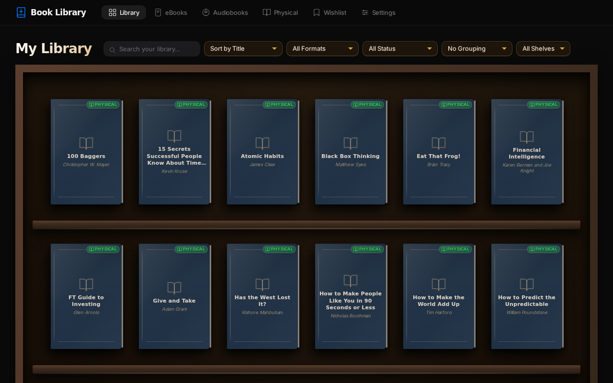
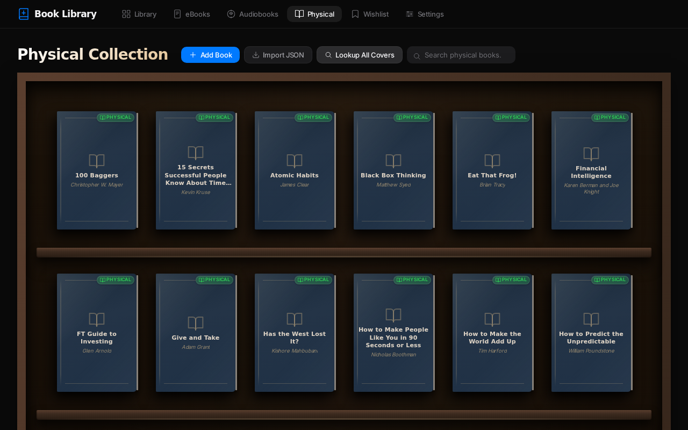

# 📚 Book Library



A beautifully designed, local-first, serverless virtual bookshelf application for organizing your collection. Crafted with a touch of **Apple × Scandinavian Minimalism**, it provides a stunning, distraction-free environment to view and manage your library.

## ✨ Features

- **Local-First & Serverless**: Built completely with offline-first architecture using IndexedDB. No backend required—your data stays on your machine.
- **Physical Book Tracker**: Keep tabs on your physical bookshelf. Automatically fetches covers when you add books!
- **E-Book & Audiobook Scanner**: Easily import and track all your digital reading.
- **Amazon Wishlist Importer**: Planning to read something new? Simply import your wishlist.
- **Stunning UI**: Custom-built variables, meticulous typography, and an interactive bookshelf interface inspired by minimalist design principles.

## 📸 Screenshots

### The Physical Collection



## 🛠️ Setup and Usage

To try it out, just serve the files locally and you're good to go!

```bash
# E.g. using http-server
npx http-server -p 8080
```

Then visit `http://localhost:8080` and start adding your books.

---
*Built for readers who want everything beautiful and under control.*
